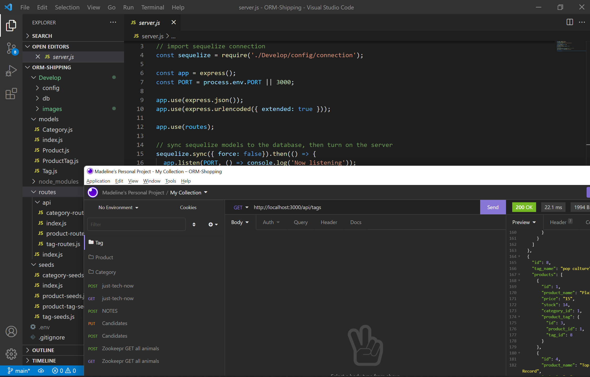
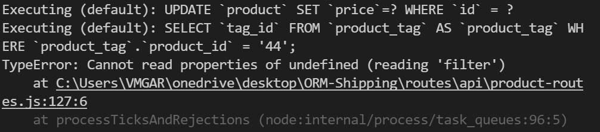

# E-commerce Back End Starter Code

# Description
For this week challenge, We were given a Starter code with a working Express.js API. The tasks was to configure it to sequelize to interact with a MySQL database. The dotenv was to store sensitive data such as MySQL username, password and databases name. Insomina was used to test the GET POST PUT and DELETE routes of all categories, Products and Tags 

### Problem that I had....
A Problem I had was with PUT routes in the product-routes.js. I was getting an TypeError about not being able to read properties as shown below: 

  
# Table of contents
[Installation](#Installation)<br>
[Usage](#Usage)<br>
[User Story](#User-Story)<br>
[Acceptance Criteria](#Acceptance-Criteria)<br>
[Credits](#Credits)<br>
[Walkthrough Video](#Walkthrough-Video)<br>


# Installation
```
npm init -y
```
### Install npm Packages
we've installed the express and mysql2 packages
```
npm install express mysql2
```
```
npm install dotenv --save
```
# Usage
Execute the script as follows:
```
node server
```
seed the Databases
```
node seeds/index.js
```
initiate the MySQL command line by typing the following in your command line:
```
mysql -u root -p
```


# User Story
```
AS A manager at an internet retail company
I WANT a back end for my e-commerce website that uses the latest technologies
SO THAT my company can compete with other e-commerce companies
```

# Acceptance Criteria
```
GIVEN a functional Express.js API
WHEN I add my database name, MySQL username, and MySQL password to an environment variable file
THEN I am able to connect to a database using Sequelize
WHEN I enter schema and seed commands
THEN a development database is created and is seeded with test data
WHEN I enter the command to invoke the application
THEN my server is started and the Sequelize models are synced to the MySQL database
WHEN I open API GET routes in Insomnia for categories, products, or tags
THEN the data for each of these routes is displayed in a formatted JSON
WHEN I test API POST, PUT, and DELETE routes in Insomnia
THEN I am able to successfully create, update, and delete data in my database
```

# Credits
GitHub: https://github.com/maddi124<br>
Starter code: https://github.com/coding-boot-camp/fantastic-umbrella.git


# Walkthrough Video
```
A walkthrough video that demonstrates the functionality of the e-commerce back end must be submitted, and a link to the video should be included in your README file.

The walkthrough video must show all of the technical acceptance criteria being met.

The walkthrough video must demonstrate how to create the schema from the MySQL shell.

The walkthrough video must demonstrate how to seed the database from the command line.

The walkthrough video must demonstrate how to start the application’s server.

The walkthrough video must demonstrate GET routes for all categories, all products, and all tags being tested in Insomnia.

The walkthrough video must demonstrate GET routes for a single category, a single product, and a single tag being tested in Insomnia.

The walkthrough video must demonstrate POST, PUT, and DELETE routes for categories, products, and tags being tested in Insomnia.
```
## mySQL shell and Files
https://watch.screencastify.com/v/V3BSzNaKnBmVDVUcNIYJ

## GET POST PUT DELETE WALKTHROUGH

https://watch.screencastify.com/v/KvGAsSrdUR8RSehhEy1U

